# 第2次隨堂題目-隨堂-QZ2
>
>學號：112111113   (學號和姓名都要寫)
><br />
>姓名：林品承
>

本份文件包含以下主題：(至少需下面兩項，若是有多者可以自行新增)
- [x] 說明內容


請在撰寫"說明程式與內容"該塊內容，請把原該塊內上述敘述刪除，該塊上述內容只是用來指引該怎麼撰寫內容。

1. a.

Ans: 

- 題目中的圖一：
(1)利用了定義名為 products 這個陣列來存放資料，並直接指定給予商品名稱與商品庫存量兩個值；
(2)之後也可以透過方法動態改變陣列的值，如 push、pop等，

---

1. b.

Ans:
- 定義⼀個放 products 商品物件的陣列，利⽤ for 迴圈以及 if 敘述式來判斷 products 這個物件陣列中的產品，
是否有⼩於10的品項；若有，就回傳商品的名稱 name 到新定義的 lowStockItems 空陣列裡⾯， return
lowStockItems 迴圈檢查結束後，會回傳收集到的低庫存商品到陣列裡，最後執⾏程式，即可印出說明文字與
lowStockItems 低庫存商品陣列中的值。
```js
    const products = [             
  { name: "keyboard", stock: 25 },
  { name: "mouse", stock: 5 },
  { name: "monitor", stock: 8 },
  { name: "usb cable", stock: 40 }
];
    function getLowStock(products) {               // 定義⼀個名叫 getLowStock 的函式，給他一個參數 products 的商品物件陣列
    const lowStockItems = [];                      // 建立⼀個空陣列 lowStockItems，⽤來收集庫存低於⾨檻的商品名稱
    for (let i = 0; i < products.length; i++) {    // 使⽤ for 迴圈，從陣列索引 0 開始，逐⼀檢查每個商品
        if (products[i].stock < 10) {              // 判斷⽬前這個商品的 stock 屬性是否⼩於 10
        lowStockItems.push(products[i].name);      // 若是，就將該商品的名稱 name 加入 lowStockItems 陣列
        }
    }
    return lowStockItems;                          // 迴圈檢查結束後，回傳收集到的低庫存商品名稱陣列
    }

    getLowStock(products);

    const lowStockItems = getLowStock(products);        //將 getLowStock 的回傳結果給常數 lowStockItems，⽅便後續的使⽤
    console.log("庫存少於 10 的商品：", lowStockItems);  //在主控台印出說明文字與低庫存商品陣列的值
    console.log("預期結果：['mouse', 'monitor']");
```
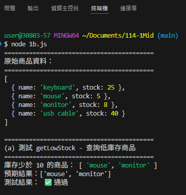
<!-- 請撰寫時，最後一句話再寫一次 -->
即可印出說明文字與lowStockItems 低庫存商品陣列中的值。

---
1. c.

Ans:
- 定義兩個陣列，包含商品庫存 products 與更新庫存 updates ，並利⽤ for 進⾏巢狀迴圈來逐⼀判斷每個商品項
⽬，並比對商品的 name 屬性是否與 updates 的屬性名稱相同，相同的話就將該商品的 stock 更新為 updates
中對應的值，使滑鼠與螢幕兩項產品庫存更新，再⽤⼀次 for 迴圈，印出每個商品的庫存，最後執⾏程式，可
以列印出商品名稱與⽬前的庫存數量。
```js
    // 定義函式 updateStock，接受兩個參數 products（商品的陣列）與 updates（要更新庫存的對應物件）
    function updateStock(products, updates) {                   
    for (let i = 0; i < products.length; i++) {        // ⽤ for 迴圈從索引 0 到 products.length-1 逐一處理 products 陣列的項目 
        const product = products[i];                   // 取出⽬前的商品物件並指派給變數 product，⽅便後續存取
        // ⽤巢狀迴圈去比對 updates 裡的每個項⽬
        for (const name in updates) {                  // 使⽤ for...in 迴圈判斷 updates 物件中的每個屬性名稱
        if (product.name === name) {                   // 比較⽬前商品的 name 屬性是否與 updates的屬性名稱相同
            product.stock = updates[name];             // 若相同，將該商品的 stock 更新為 updates中對應的值
        }
        }
    }

    // 再次使⽤ for 迴圈逐⼀⾛訪 products，準備印出每個商品的庫存
    for (let i = 0; i < products.length; i++) {
        console.log(products[i].name + " 的庫存：" + products[i].stock);  //在 console 印出商品名稱與⽬前的庫存數量
    }
    return products;                          // 回傳已更新的 products 陣列
    }

    const updates = {
    mouse: 15,
    monitor: 20
    };

    console.log("要更新的商品：", updates);
    console.log("");
    const updatedProducts = updateStock(products, updates);
```
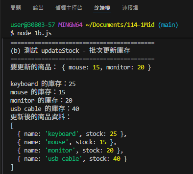
<!--  請撰寫時，第一句話再寫一次  -->
定義兩個陣列，

---
2. a.

Ans:
- 使⽤ switch 敘述完成路由判斷。若url值為'/'，則輸出顯⽰'index.html輸出部分'字樣；若url值為'/calculator'，
則輸出顯⽰'index2.html 輸出的部分'字樣；若url 的值不是上述任何⼀個 case，則輸出顯⽰'error.html 輸出的部
分'字樣。
```js
//1、引入http模組
const http = require('http');

//2、創建http伺服器
    const server = http.createServer(function (request, response) {
    const url = request.url;  //獲取請求位址
    console.log(url)
    var answer = '';  //設置回應內容

    // 請寫 switch完成各個收到不同的請求以及輸出不同的回應字串 (使用 switch)
    switch (url) {                              // 根據變數 url 的值來進⾏條件判斷
        case '/':                               // 如果 url 的值是 '/'
        answer = 'index.html 輸出部分';          // 將 answer 設為 'index.html輸出部分'
        break;                                  // 結束這個 case，不繼續執⾏後續的 case
        case '/calculator':                     // 如果 url 的值是 '/calculator'
        answer = 'index2.html 輸出的部分';       // 將 answer 設為 'index2.html 輸出的部分'
        break;                                  // 結束這個 case，不繼續執⾏後續的 case
        default:                                // 如果 url 的值不是上述任何⼀個 case
        answer = 'error.html 輸出的部分';        // 將 answer 設為 'error.html 輸出的部分'
        break;                                  // 結束 switch
    }

    
    response.setHeader('Content-Type', 'text/plain;charset=utf-8'); //設置回應頭編碼為utf-8，避免中文亂碼
    response.end(answer);
    });
    //3、啟動伺服器監聽8888埠
    server.listen('8888', function () {
    console.log("伺服器啟動成功，訪問：http://127.0.0.1:8888")
    })
```
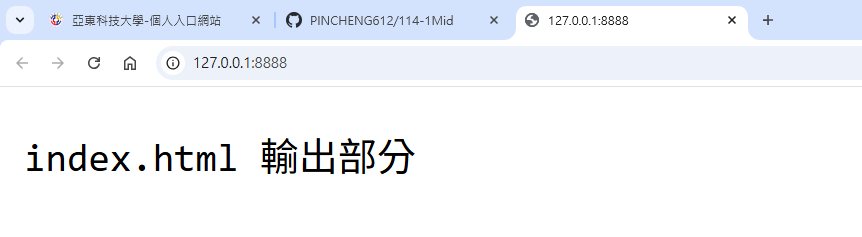
如上圖，如果 url 的值是 '/'，設為 'index.html輸出部分'。
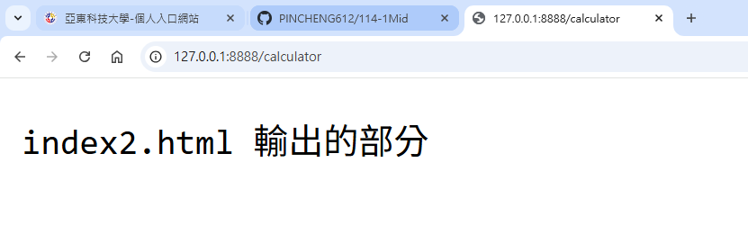
如上圖，如果 url 的值是 '/calculator'，設為 'index2.html 輸出的部分'。
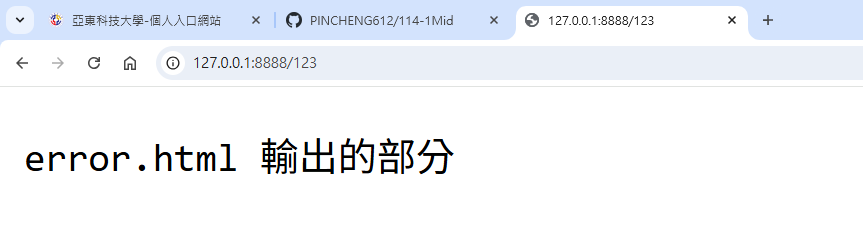
如上圖，如果 url 的值不是上述任何⼀個 case，設為 'erroe.html 輸出的部分'。
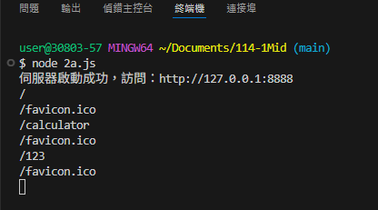
<!--  請撰寫時，第一句話再寫一次  -->
使⽤ switch 敘述完成路由判斷。

---
2. b.

Ans:
- ⾸先必須先引入需要⽤到的模組後，並建立伺服器，開始定義對應的 MIME 類型，且利⽤ switch 敘述來設定路
由，能夠對應到設定到 ejs 模板與 css 樣式，並開始利⽤ for 迴圈， 判斷請求是否為 .ejs 。若是，就執⾏模板
渲染進⾏ fs.readFile 非同步讀檔，中間若發⽣錯誤，則讀取失敗並回傳錯誤訊息，若成功，就傳送渲染後
HTML 並結束回應；若不是.ejs，則開始處理靜態檔案進⾏ fs.readFile 非同步讀檔，中間若發⽣錯誤，則同樣讀
取失敗並回傳錯誤訊息，成功的話就傳送檔案內容。最後在 3000 埠啟動伺服器並開始監聽連線，啟動成功時
在控制台印出提⽰。

```js
    // 1. 引入模組
    const http = require('http');               // http 模組：用於創建 HTTP 伺服器
    const fs = require('fs');                   // fs 模組 (File System)：用於讀取檔案系統中的文件
    const ejs = require('ejs');                 // ejs 模組：用於渲染 EJS 模板引擎，將動態內容嵌入 HTML
    const path = require('path');               // path 模組：用於處理和解析文件路徑，提取副檔名

    // 2. 建立伺服器（每次有 HTTP 請求會呼叫回呼函數）
    http.createServer((req, res) => {           // createServer 接收 request 與 response 物件
    console.log('使⽤者請求網址：', req.url);    // 取得使⽤者請求的 URL

    const url = req.url;                       // 例如 '/' 或 '/style.css' 或 '/calculator'

    const extname = path.extname(url);         // 取得副檔名（ex: '.css'、'.ejs'、'.png'）

    // 3. 定義對應 MIME 類型（副檔名 → Content-Type）
    const mime = {                              // ⽤物件快速對照常⽤副檔名的回應類型
    '.html': 'text/html; charset=utf-8',        // HTML 網頁文件
    '.js': 'text/javascript; charset=utf-8',    // JavaScript 腳本文件
    '.css': 'text/css; charset=utf-8',          // CSS 樣式表文件
    '.png': 'image/png',                        // PNG 圖片格式
    '.jpg': 'image/jpeg',                       // JPG/JPEG 圖片格式
    '.gif': 'image/gif',                        // GIF 動畫圖片
    '.ico': 'image/x-icon'                      // 網站 favicon 圖示
    };

    let filePath = '';                          // 將存放要讀取的 EJS 檔案路徑
    let filecss = '';                           // 將存放對應的 CSS 檔案路徑

    // 4. 根據不同路由設定對應模板與樣式（簡單路由對應）
    switch (url) {                              // 使⽤ switch 分⽀依 url 指定要載入的模板與 css
        case '/':                               // 當訪問網站根⽬錄
            filePath = '/index.ejs';            // 對應 index.ejs 模板
            filecss = '/style.css';             // 對應 style.css
        break;
        case '/calculator':                     // 當訪問 /calculator 路徑
            filePath = '/index2.ejs';           // 對應 index2.ejs 模板
            filecss = '/style2.css';            // 對應 style2.css
        break;
    }

    // 5. 如果請求為 .ejs → 執⾏模板渲染（或當 request 為根路徑 / 或 /calculator）
    if (extname === '.ejs' || url === '/' || url === '/calculator') {
      fs.readFile('.' + filePath, 'utf8', (err, template) => {            // 非同步讀檔：讀取.ejs 模板內容（UTF-8）
    if (err) {                                                            // 若發⽣錯誤（檔案不存在或讀取失敗）
      res.writeHead(500, { 'Content-Type': 'text/html; charset=utf-8' }); // 回傳 500 及內容型態
      res.end('錯誤：無法讀取模板文件 - ' + err.message);                   // 傳送錯誤訊息並結束回應
    return;                                                               // 中⽌後續處理
    }

    // 渲染 EJS 模板（可傳入動態資料）
    const html = ejs.render(template, {                                   // ejs.render(template,data)：回傳渲染後的 HTML 字串
    stylePath: filecss                                                    // 把 CSS 路徑傳入模板內可使⽤ <%= stylePath %>
    });
    res.writeHead(200, { 'Content-Type': 'text/html; charset=utf-8' });   // 成功：回應 200，內容為 HTML（UTF-8）
    res.end(html);                                                        // 傳送渲染後 HTML 並結束回應
    });
    } else {
    // 6. 處理靜態檔案 (.css、.js、圖片等)
    const staticFilePath = '.' + url;                                     // 對應實際檔案系統路徑，例：./style.css
    const contentType = mime[extname] || 'text/plain; charset=utf-8';     // 從 mime對照表取得 Content-Type，沒有對應就⽤ text/plain
    fs.readFile(staticFilePath, (err, content) => {                       // 非同步讀取靜態檔案（Binary 或文字）
    if (err) {
    res.writeHead(404, { 'Content-Type': 'text/html; charset=utf-8' });   // 回傳 404
    res.end('404 - 找不到文件：' + url);                                   // 傳送錯誤訊息
    } else {                                                              // 讀取成功
    res.writeHead(200, { 'Content-Type': contentType });                  // 回傳 200 與正確Content-Type
    res.end(content);                                                     // 傳送檔案內容（若為圖片則是 binary）
    }
    });
    }
    }).listen(3000, () => {                                               // 在 3000 埠啟動伺服器並開始監聽連線
    console.log('伺服器已啟動：http://localhost:3000');                    // 啟動成功時在控制台印出提⽰
    console.log('可⽤路由：');
    console.log(' - http://localhost:3000');
    console.log(' - http://localhost:3000/calculator');
    console.log(' - 其他路徑將顯⽰ 404 錯誤⾴⾯');
    });
```
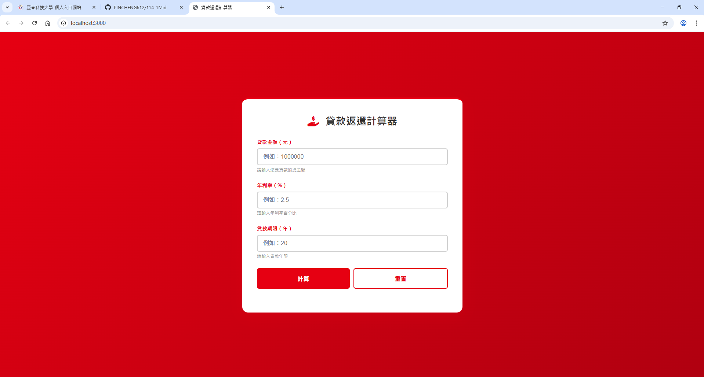
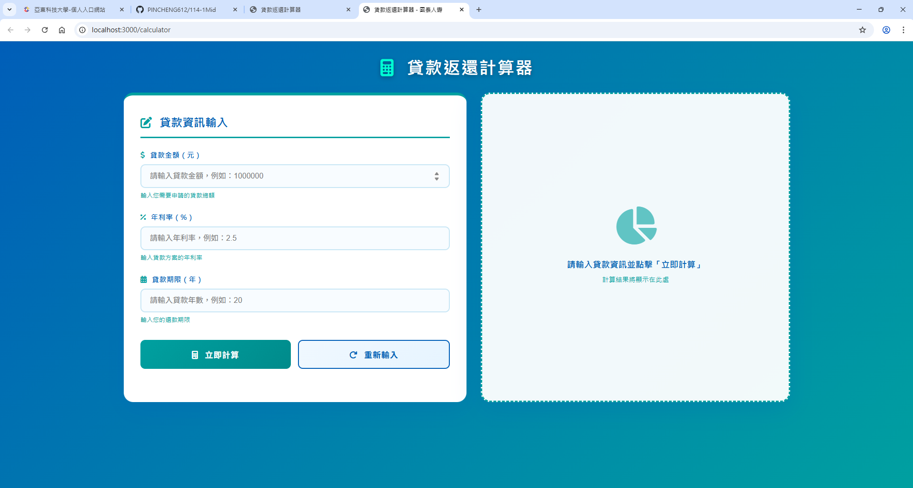
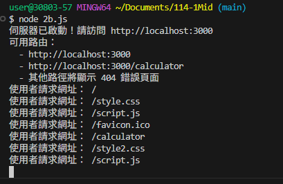
<!--  請撰寫時，第一句話再寫一次  -->
⾸先必須先引入需要⽤到的模組後，

---
2. c.

Ans:
- 在原本處理靜態檔案的程式區塊，新增以下程式；在原本的 fs.readFile 處理非同步讀取檔案的地⽅，修改
內容中 if 敘述式的分⽀結構，多增加⼀個條件為 err 的話，就讀取'./index3.ejs'的這個檔案； ejserr 的話，則回
傳404錯誤訊息。
```js
    fs.readFile(staticFilePath, (err, content) => {          // 非同步讀取靜態檔案（Binary 或文字）
      if (err) {
        fs.readFile('./index3.ejs', 'utf8', (ejsErr, template) => {
            res.writeHead(404, { 'Content-Type': 'text/html; charset=utf-8' });   //回傳 404
            if (ejsErr) {                                    // 若讀取失敗（找不到檔案等）
                res.end('404 - 找不到文件：' + url);          // 傳送錯誤訊息
        }  else{
            const html = ejs.render(template, {stylePath: '/style3.css'});
            res.writeHead(404, { 'Content-Type': 'text/html; charset=utf-8' });
            res.end(html);
        }
    });
    } else {                                                 // 讀取成功
        res.writeHead(200, { 'Content-Type': contentType }); // 回傳 200 與正確Content-Type
        res.end(content);                                    // 傳送檔案內容（若為圖片則是 binary）
        }
    });
```
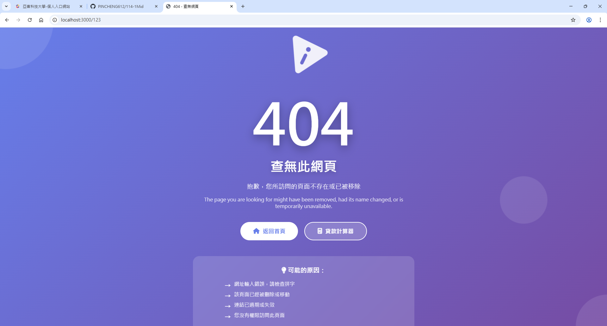
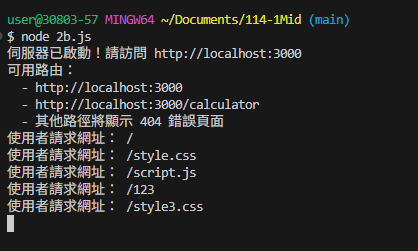
<!--  請撰寫時，第一句話和最後一句再寫一次  -->
 在原本處理靜態檔案的程式區塊  ；  則回傳404錯誤訊息。

---
2. d.

Ans:
- 客戶端跟伺服器端請求最少有3次，包含客戶端的請求1次，與伺服器端js和css 2次。

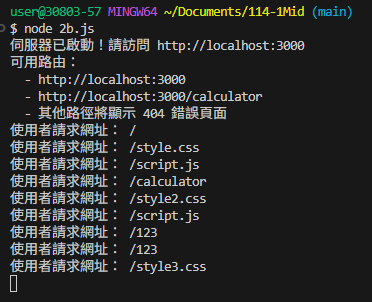


